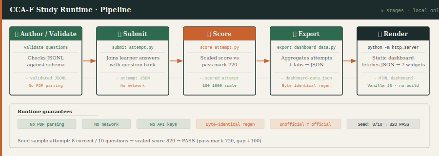
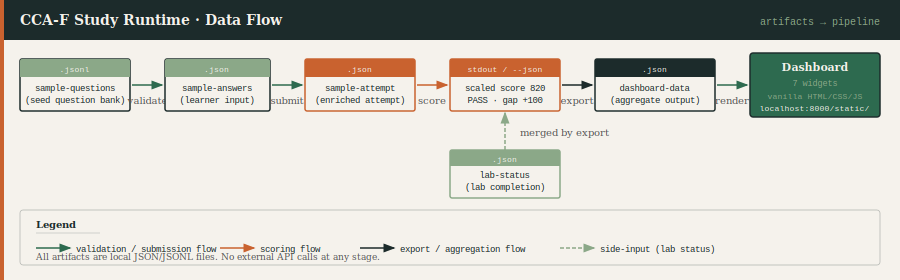
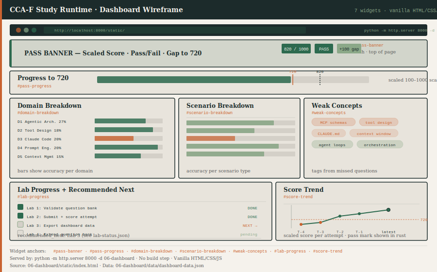
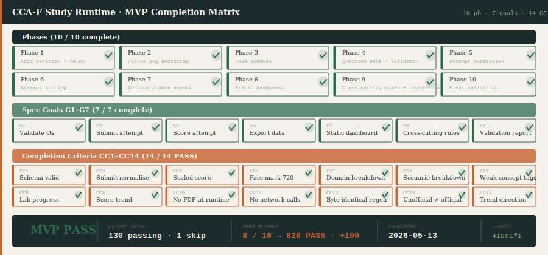

# CCA-F Study Runtime

A dependency-light Python study toolkit for the Claude Certified Architect — Foundations (CCA-F) exam. It validates a local question bank, records mock-exam attempts, computes a scaled score against the 720 pass mark, and serves a seven-widget static dashboard — with no PDF parsing, no network calls, and no API keys required at any stage.

## Status

| Metric | Value |
|---|---|
| MVP phases complete | 10 / 10 |
| Spec goals (G1–G7) | 7 / 7 |
| Completion criteria (CC1–CC14) | 14 / 14 PASS |
| pytest | 130 passing · 1 intentional skip |
| Seed attempt | 8 / 10 correct → scaled 820 → **PASS** (gap +100) |
| Latest commit | `418c1f1` Phase 10: final validation report — MVP PASS |

---

## Runtime pipeline



---

## What it does

- **Register and validate questions.** Write or import questions in JSONL format; `validate_questions` checks every field against the JSON schema before anything else runs.
- **Submit a mock-exam attempt.** `submit_attempt` joins your answer choices with the question bank, normalising casing and recording per-question metadata.
- **Score against the CCA-F pass mark.** `score_attempt` computes a scaled score on the 100–1000 scale (`100 + correct/total × 900`) and compares it to the 720 pass mark.
- **Export a deterministic dashboard payload.** `export_dashboard_data` aggregates every attempt and your lab-status file into a single `dashboard-data.json`; re-running with the same inputs produces byte-identical output.
- **Review your progress in a browser.** A vanilla HTML/CSS/JS dashboard served by `python -m http.server` shows pass/fail, domain gaps, weak concept tags, lab progress, and a score trend — no build step, no CDN.
- **Stay completely local.** Every artifact is a plain JSON or JSONL file. Nothing reads the source PDF at runtime; nothing phones home.

---

## Quick start

Run the six commands below in order on first setup (after `pip install -e ".[dev]"`):

```bash
# 1. Validate the seed question bank (schema check)
python -m cca_f_study.validate_questions 02-question-bank/seed/sample-questions.jsonl

# 2. Submit a mock-exam attempt (joins answers with question bank)
python 04-exam-runner/submit_attempt.py \
  --questions 02-question-bank/seed/sample-questions.jsonl \
  --answers   examples/attempts/sample-answers.json \
  --out       05-learning-data/attempts/sample-attempt.json

# 3. Score the attempt (scaled score vs pass mark 720)
python 04-exam-runner/score_attempt.py 05-learning-data/attempts/sample-attempt.json

# 4. Export dashboard data (aggregate attempts + lab status)
python 04-exam-runner/export_dashboard_data.py \
  --attempts   05-learning-data/attempts \
  --lab-status 05-learning-data/lab-status.json \
  --out        06-dashboard/data/dashboard-data.json \
  --now        2026-05-12T00:30:00Z

# 5. Serve the static dashboard
python -m http.server 8000 -d 06-dashboard
# then open http://localhost:8000/static/

# 6. Run the full test suite
pytest
```

---

## Data flow



| Artifact | Produced by | Consumed by |
|---|---|---|
| `02-question-bank/seed/sample-questions.jsonl` | hand-authored | `validate_questions`, `submit_attempt` |
| `examples/attempts/sample-answers.json` | learner input | `submit_attempt` |
| `05-learning-data/attempts/sample-attempt.json` | `submit_attempt` | `score_attempt`, `export_dashboard_data` |
| `05-learning-data/lab-status.json` | hand-authored | `export_dashboard_data` |
| `06-dashboard/data/dashboard-data.json` | `export_dashboard_data` | static dashboard |

---

## Dashboard preview



The dashboard answers seven questions in one view:

1. **Did I pass?** Pass/fail banner with scaled score and gap to 720.
2. **How close to the pass mark?** Visual progress bar on the 100–1000 scale.
3. **Which domains need work?** Accuracy bars for each of the five CCA-F domains (D1–D5).
4. **Which scenario types trip me up?** Per-scenario accuracy breakdown.
5. **What concepts should I study next?** Weak concept tags derived from missed questions.
6. **Where am I in the lab sequence?** Lab completion status and `recommended_next`.
7. **Is my score improving?** Attempt-by-attempt trend sparkline.

---

## Project status



| Category | Total | Complete |
|---|---|---|
| Plan phases | 10 | **10** |
| Spec goals (G1–G7) | 7 | **7** |
| Completion criteria (CC1–CC14) | 14 | **14** |

See the [final validation report](docs/reviews/2026-05-cca-f-study-runtime-mvp-final-validation.md) for the full evidence record.

---

## Layout

```text
.
├── CLAUDE.md                          # project rules (safety, scoring, question rules)
├── README.md
├── pyproject.toml
├── 00-meta/                           # source register, domain/scenario maps
├── 01-sources/en/                     # canonical source PDF (read-only; never parsed at runtime)
├── 02-question-bank/
│   └── seed/
│       └── sample-questions.jsonl    # 10 seed questions
├── 04-exam-runner/
│   ├── question_schema.json
│   ├── attempt_schema.json
│   ├── submit_attempt.py             # CLI shim
│   ├── score_attempt.py              # CLI shim
│   └── export_dashboard_data.py      # CLI shim
├── 05-learning-data/
│   ├── attempts/                     # attempt JSON files
│   └── lab-status.json
├── 06-dashboard/
│   ├── data/
│   │   └── dashboard-data.json       # export output
│   └── static/
│       └── index.html                # 7-widget static dashboard
├── examples/
│   └── attempts/
│       └── sample-answers.json
├── docs/
│   ├── assets/                       # SVG diagrams (this README embeds them)
│   ├── plans/
│   ├── reviews/
│   ├── specs/
│   └── use-cases/
├── src/
│   └── cca_f_study/
│       ├── __init__.py
│       ├── validate_questions.py
│       ├── submit_attempt.py
│       ├── score_attempt.py
│       ├── export_dashboard_data.py
│       ├── _aggregate.py
│       ├── _scoring.py
│       └── _schemas/
└── tests/                             # 130 passing · 1 intentional skip
```

---

## Safety and boundaries

- **No PDF parsing at runtime.** The source PDF is a read-only evidence artifact; no runtime module opens it.
- **No network calls.** No HTTP requests at any stage. Tested by `tests/test_no_network_calls.py`.
- **No secrets or API keys.** The runtime needs only a Python 3.x interpreter and the local files above.
- **Generated questions are never "official".** Any question not derived from the registered source carries `status != "official"`.
- **Dashboard stays static.** The frontend is vanilla HTML/CSS/JS served by `python -m http.server`; no build step, no CDN.
- **Byte-identical regeneration.** Running `export_dashboard_data` twice with the same inputs produces the same bytes. Verified by `tests/test_dashboard_data_byte_identical.py`.

---

## Documentation index

- [MVP specification](docs/specs/2026-05-cca-f-study-runtime-mvp.md)
- [Implementation plan](docs/plans/2026-05-cca-f-study-runtime-mvp-plan.md)
- [Final validation report](docs/reviews/2026-05-cca-f-study-runtime-mvp-final-validation.md)
- [Project rules](CLAUDE.md)
- [Visual overview](docs/overview.html) — single-page summary with all four diagrams at full size

---

## Out of scope (post-MVP)

- Adaptive question generation (calling Claude API to draft new questions).
- Multi-user or remote deployment; this runtime is single-machine only.
- Automatic PDF parsing to extract questions from the source guide.
- CI/CD pipeline; all verification is local pytest.
- Persistent database; all data lives in plain JSON/JSONL files.
- Interactive question editor; questions are authored by hand in JSONL.
